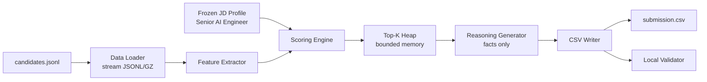

# System Architecture

## Overview

The system is a streaming, deterministic ranker. It reads `candidates.jsonl` one row at a time, extracts evidence-weighted features, scores each candidate, keeps a bounded top-K heap, generates fact-grounded reasoning for the final top 100, and writes a validator-compliant CSV.

## Modules

- `src/data_loader.py`: streams JSONL and GZ without loading all candidates.
- `src/jd_features.py`: encodes the extracted JD requirements.
- `src/features.py`: produces technical, experience, career, behavior, and risk features.
- `src/scoring.py`: scoring facade.
- `src/ranking.py`: bounded heap ranking and score normalization.
- `src/reasoning.py`: concise explanations from retained facts.
- `src/submission.py`: writes CSV and optional debug JSON.
- `src/validate.py`: mirrors the challenge CSV validator.
- `run.py`: single command entry point.

## Runtime And Memory

- CPU only.
- No network calls.
- No external model downloads.
- Standard library only.
- Streaming data loader and bounded heap keep memory low.
- Full local run on 100K candidates completed in about 42 seconds after cache warmup.

## Explainability

For every submitted candidate, the ranker retains:

- current title, company, location, years.
- technical evidence labels from career history.
- relevant skills actually present in the profile.
- Redrob behavioral facts.
- concerns and risk flags.

The `reasoning` column is generated only from these retained facts, reducing hallucination risk.

